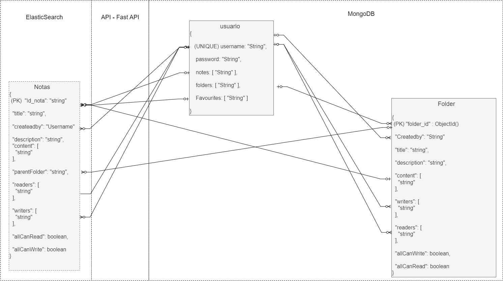

# Notilokos

Este proyecto forma parte del trabajo final de la materia Bases de Datos 2, donde se pide realizar un software para el manejo de notas utilizando la técnica de persistencia políglota con las bases de datos analizadas durante la cursada de la materia.

Una descripción con mayor detalle se puede encontrar en <a href="https://docs.google.com/presentation/d/1McvCL0FnLXXur0-HPIOZXAANOZ_mE9RxHxnfA2_eOyQ/edit?usp=sharing">la presentación</a> realizada.

Los miembros del grupo <b>Los Notilokos</b> somos:
* [BIRSA, NICOLAS EZEQUIEL](https://github.com/Fegrant)
* [MIHURA, URIEL](https://github.com/uri-99)
* [SOLEÑO, JUSTO NICOLAS](https://github.com/JustoSole)


## Índice

<ol>
    <li>
      <a href="#acerca-del-proyecto">Acerca del proyecto</a>
      <ul>
        <li><a href="#tecnologías-usadas">Tecnologías usadas</a></li>
        <li><a href="#app-scehma">App schema</a></li>
      </ul>
    </li>
    <li>
        <a href="#instalación">Instalación</a>
        <ul>
            <li><a href="#variables-de-entorno">Variables de entorno</a></li>
            <li><a href="#programas-necesarios">Programas necesarios</a></li>
            <li><a href="#dependencias">Dependencias</a></li>
        </ul>
    </li>
    <li>
        <a href="#uso">Uso</a>
        <ul>
            <li><a href="#deploy">Deploy</a></li>
            <li><a href="#autenticación">Autenticación</a></li>
            <li><a href="#permisos">Permisos</a></li>
        </ul>
    </li>
    <li>
        <a href="#desarrollo-del-proyecto">Desarrollo del proyecto</a>
            <ul>
                <li><a href="#funcionalidades-agregadas">Funcionalidades agregadas</a></li>
                <li><a href="#dificultades-encontradas">Dificultades encontradas</a></li>
            </ul>
    </li>
    <li>
        <a href="#roadmap">Roadmap</a>
    </li>
  </ol>


## Acerca del proyecto

Notilokos es un software para el manejo de notas, donde un usuario puede:
- Crear, editar y borrar sus notas. Esto último solo lo puede hacer el dueño de la nota.
- Compartir notas sólo a aquellos que le de permisos, o publicar la nota y que sea legíble o editable por cualquiera.
- Organizar sus notas en carpetas que también puede compartir a quienes quiera.
- Guardar notas de otros como notas favoritas.

Se expone una API para los distintos pedidos de usuarios, donde se puede usar el Swagger generado para realizar dichos pedidos de una manera más fácil y cómoda.

### Tecnologías usadas

* [![FastAPI][fastapi-logo]][fastapi-url]
* [![MongoDB][mongodb-logo]][mongodb-url]
* [![Elasticsearch][elastic-logo]][elastic-url]
* [![Swagger][swagger-logo]][elastic-url]
* [![JSON Web Tokens][jwt-logo]][jwt-url]

La API del proyecto se hizo usando <a href="https://fastapi.tiangolo.com/">FastAPI</a>, ya que es una tecnología fácil de usar y con mucha documentación disponible para el proceso de desarrollo, desde el primer endpoint local hasta el deploy. A su vez, nos permite generar el <a href="https://swagger.io/">Swagger</a> como documentación y primera interfaz para interactuar con la API.

Por otro lado, para guardar los datos de la aplicación se utilizó la técnica de persistencia políglota, donde se eligieron como bases de datos a usar <a href="https://www.mongodb.com/">MongoDB</a> y <a href="https://www.elastic.co/elasticsearch/">Elasticsearch</a>. La primera, para el guardado de usuarios y carpetas, cuyo formato puede cambiar a futuro, mientras que las notas se guardan en Elasticsearch para agilizar la búsqueda y modificación de estas, que son las principales acciones que realizarán los usuarios.

Por último, para la autenticación de los usuarios usamos <a href="https://jwt.io/">JSON Web Tokens</a>, o JWT, donde un usuario se autentica en primera instancia y se le devuelve un token que usará para autenticarse en los siguientes pedidos.

### Data base schema

Se puede ver la estructura general de las bases de datos del proyecto a continuación:



## Instalación

### Variables de entorno

Por motivos de seguridad, en el código del proyecto no se exponen claves como las usadas para acceder a las bases de datos o generar tokens.

Sin embargo, resulta muy fácil configurarlas, ya que es ubicar un archivo `.env` en el proyecto con las mismas, que conste de:

```js
MONGODB_PASS=<clave_de_mongo>
JWT_KEY=<clave_de_64_bytes>
ELASTIC_USER=<usuario_de_elastic>
ELASTIC_PASSWORD=<contraseña_de_elastic>
ELASTIC_CLASS_ID=<id_de_la_clase>
```

Como mención, la clave de Mongo es un <a href="https://www.mongodb.com/docs/manual/reference/connection-string/">string de conexión</a> que se puede obtener en dicha base de datos.

### Programas necesarios

Como prerequisito, se necesita tener instalado python y su sistema de gestión de paquetes pip. Este último se instala con:

```sh
# Descarga del archivo de instalación
$ curl https://bootstrap.pypa.io/get-pip.py -o get-pip.py

# Instalación de pip
$ python get-pip.py
```

Luego, para correr el proyecto localmente se necesita de un <a href=https://asgi.readthedocs.io/en/latest/>servidor ASGI</a>. En nuestro caso, usaremos el de <a href="https://www.uvicorn.org/">Uvicorn</a>. Para instalarlo se corre:

```sh
$ pip install uvicorn
```

### Dependencias

Antes de correr el proyecto, hay que instalar una serie de dependencias necesarias para la API, bases de datos y funciones usadas internamente.

Todas estas se encuentran dentro del archivo `requirements.txt` que está en la carpeta raíz del proyecto, por lo que para instalar todas las dependencias basta con correr:

```sh
$ pip install -r requirements.txt
```

<b><h4>Tip extra:</h4></b> Si en un futuro se desea deployear la aplicación en alguna plataforma como <a href="https://www.deta.sh/">Deta</a>, este archivo también servirá para indicarle al servidor remoto que dependencias debe instalar previo a correr la aplicación.


## Uso

Para correr la API localmente se usa el programa Uvicorn antes instalado, de la siguiente manera:

```sh
$ uvicorn main:app --host 127.0.0.1 --port 8000
```

Esto hará que la API corra en la url 127.0.0.1, puerto 8000.

Para acceder al Swagger se deberá dirigir a la url http://127.0.0.1:8000/docs#/, donde estará disponible la documentación de la API y se podrán realizarle pedidos. La interfaz será una parecida a la siguiente:

[![Product Name Screen Shot][product-screenshot]](https://petstore.swagger.io/)

### Deploy

La última versión de esta API ya se encuentra deployeada en la url https://u9usr1.deta.dev, conectada a bases de datos propias con data de ejemplo, para poder interactuar con ella y ver su funcionamiento.

De igual manera, el Swagger se encuentra en https://u9usr1.deta.dev/docs donde se puede ver la documentación y llamar a los métodos HTTP de una forma más sencilla.

### Autenticación

Para realizar ciertos pedidos se requiere que el usuario esté autenticado, por lo que primero se deberá crear una cuenta mediante un `POST /users` donde estén usuario y contraseña, como se aclara en el Swagger.

Luego, para inciar sesión el usuario deberá mandar un `POST /token` con el usuario y contraseña dentro del body del request, de tipo `x-www-form-encoded`.

Este pedido devolverá un token de tipo <a href=https://jwt.io/>JWT</a>, el cual contiene la información sobre el usuario loggeado y se usará para los pedidos que requieran autenticación, siendo incluido en el header de authorization de la request como:

```sh
Authorization: Bearer <jwt_token>
```

Este token será válido por hasta 30 minutos posterior a su generación, momento en que el usuario debe realizar el `POST /token` nuevamente.

Para agilizar el log in, Swagger ofrece un botón `Authorize`, el cual el usuario podrá utilizar llenando su usuario y contraseña y apretando `Authorize`. Swagger mantendrá la sesión guardada siempre y cuando no se refresque la página.

### Permisos

Igualmente, aunque el usuario haya iniciado sesión, hay una serie de acciones que sólo puede realizar si se le otorgaron los permisos necesarios o directamente no puede realizar, a ser:
- Lectura y modificación de archivos que son privados o sólo compartidos a algún grupo de usuarios, en el que no se encuentra el usuario activo.
- Borrado de notas, carpetas y cuentas de otros usuarios.
- Modificaciones de la lista de favoritos de otros usuarios.


## Desarrollo del proyecto

### Funcionalidades agregadas

En comparación al MVP y sus funcionalidades detallados en <a href="https://docs.google.com/presentation/d/1McvCL0FnLXXur0-HPIOZXAANOZ_mE9RxHxnfA2_eOyQ/edit?usp=sharing">la presentación</a> antes mencionada, se vieron varias oportunidades de mejora que finalmente se realizaron, y entre las cuales se encuentran las siguientes:
- Uso de <a href=https://jwt.io/>JWT</a> para la autenticación de los pedidos y manejo de sesiones de usuarios en detrimento de solo usar un header de tipo `Authorization: Basic 3ff==`.
- Borrado de cuentas de usuarios, donde en dicho proceso también se borran sus carpetas y notas.
- Uso del campo username de cada Usuario como su id, en vez del autogenerado por Mongo, ya que también es un campo de tipo `UNIQUE` debido al índice agregado, además que aporta mayor legibilidad. que éste último.
- Siguiendo con el objeto Usuario, se quitó el campo de mail ya que no lo terminamos usando. Pero, dada la estructura flexible de Mongo, se podría agregar soporte para esto en un futuro.
- Para mejorar la privacidad, un usuario no puede saber cuáles son las notas favoritas de otros, ni tampoco saber quiénes son los otros lectores y escritores de carpetas, a menos que sea el dueño de la misma.
- Los métodos `PUT` de modificar notas y carpetas se remplazaron por los de tipo `PATCH` además de cambiar su implementación inicial, para que el usuario pueda modificar parcialmente una nota o carpeta.
- En la búsqueda de notas, se aprovechó el potencial de Elasticsearch con búsquedas por valores parecidos y ordenamiento de resultados por similitud.
- La API, que inicialmente se pensó local, ahora también se encuentra deployeada. El link está en la sección previa de <a href="#deploy">Deploy</a>.

### Dificultades encontradas

Al igual que las mejoras, durante el desarrollo del proyecto se encontraron diversos problemas. Algunos se solucionaron cambiando la forma en que se encaraban mientras que otros se decició no cubrirlos debido a que el ratio esfuerzo/riesgo cubrido no se justificaba.

Dentro de los primeros, están los siguientes casos:
- A la hora de hacer el set-up de ES, el correrlo localmente utilizando Docker consumía demasiados recursos, por lo que se decidió hostearlo remoto. Así, ya que tanto la API como MongoDB se encontraban hosteadas en la nube, se pudo lograr que la aplicación sea completamente accedible de manera remota.
- Las notas ahora se encuentran sólo en ES, opuesto a lo pensado inicialmente de que MongoDB tenga la copia original y ES una copia para búsquedas. Esto ya que, luego de evaluar la propuesta inicial, consideramos esta alternativa como más performante y fácil de implementar que tener que sincronizar ambas bases de datos y mantener una copia en ES.
- Como el id autogenerado de ES es incremental, y necesitabamos que sea uno más complejo y privado, los id's de notas se generan del lado de la API. Para generarlos, se decidió adaptar un esquema de generación parecido al de mongo, usando <a href="https://docs.python.org/3/library/uuid.html">uuids</a> que toman como base el id de la máquina, la hora y una secuencia aleatoria, lo que lo hace ideal para ser generado en un contexto distribuido.
- Para referenciar los objetos en MongoDB, inicialmente se usó el ObjectId de cada uno, pero se decidió cambiar al string que forma dicho ObjectId, ya que traía bastantes problemas de parseos, y al siempre hacer dicho parseo se realentizaba el pedido en comparación a si se guardaba directamente en formato string.
- Se cambió el campo de `public` de una nota o carpeta que indicaba quiénes podían acceder a ella por los de `allCanRead` y `allCanWrite`, ambos tomando valores booleanos. Esto se decidió así porque la primera opción indicaba un valor de acceso tanto para escritores y lectores que no llegaba a cubrir todos los casos posibles, mientras que con la segunda se puede rápidamente chequear sus valores, y en base a ellos decidir si también consultar los arrays correspondientes de lectores y escritores.


## Roadmap

Mejoras a futuro del proyecto:

- [ ] Diseñar front de la aplicación.
- [ ] Implementar transacciones atómicas a nivel de software para las operaciones que le correspondan.
- [ ] Implementar estructura MVC, con capas de front, servicios y persistencia, para separar responsabilidades y facilitar cambios a futuro.

[fastapi-logo]: https://img.shields.io/badge/FastAPI-000000?logo=fastapi
[fastapi-url]: https://fastapi.tiangolo.com/
[mongodb-logo]: https://img.shields.io/badge/MongoDB-ffffff?logo=mongodb
[mongodb-url]: https://www.mongodb.com/
[elastic-logo]: https://img.shields.io/badge/Elasticsearch-52a0db?logo=elasticsearch
[elastic-url]: https://www.elastic.co/elasticsearch/
[swagger-logo]: https://img.shields.io/badge/Swagger-808080?logo=swagger
[swagger-url]: https://swagger.io/
[jwt-logo]: https://img.shields.io/badge/JWT-d63aff?logo=jsonwebtokens
[jwt-url]: https://jwt.io/
[product-screenshot]: https://static1.smartbear.co/swagger/media/images/tools/opensource/swagger_ui.png?ext=.png
